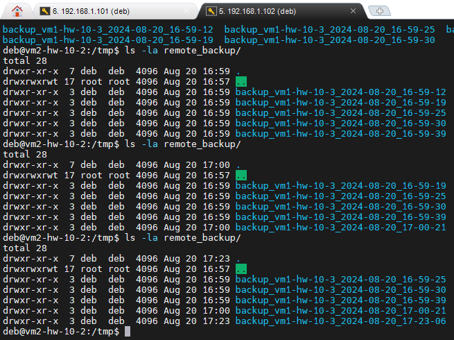

# Домашнее задание к занятию 3 «Резервное копирование» — Изотов Максим

### Цель задания
В результате выполнения этого задания вы научитесь:
1. Настраивать регулярные задачи на резервное копирование (полная зеркальная копия)
2. Настраивать инкрементное резервное копирование с помощью rsync

------

### Чеклист готовности к домашнему заданию

1. Установлена операционная система Ubuntu на виртуальную машину и имеется доступ к терминалу
2. Сделан клон этой виртуальной машины с другим IP адресом


------

### Задание 1
- Составьте команду rsync, которая позволяет создавать зеркальную копию домашней директории пользователя в директорию `/tmp/backup`
- Необходимо исключить из синхронизации все директории, начинающиеся с точки (скрытые)
- Необходимо сделать так, чтобы rsync подсчитывал хэш-суммы для всех файлов, даже если их время модификации и размер идентичны в источнике и приемнике.
- На проверку направить скриншот с командой и результатом ее выполнения

### *Ответ*

Команда:
```
rsync -ac --exclude ".*" . /tmp/backup
```
Опция --checksum (сокращенно -c), сообщает rsync о необходимости вычислить хэш-суммы для сравнения файлов.

Скриншот:


### Задание 2
- Написать скрипт и настроить задачу на регулярное резервное копирование домашней директории пользователя с помощью rsync и cron.
- Резервная копия должна быть полностью зеркальной
- Резервная копия должна создаваться раз в день, в системном логе должна появляться запись об успешном или неуспешном выполнении операции
- Резервная копия размещается локально, в директории `/tmp/backup`
- На проверку направить файл crontab и скриншот с результатом работы утилиты.

### *Ответ*

Команда в crontab:
```
15 15 * * * $HOME/Documents/scripts/backup-home.sh
```

Bash-скрипт [backup-home.sh](file/3/backup-home.sh) отработал в 15:15:01, скриншот:


---

## Задания со звёздочкой*
Эти задания дополнительные. Их можно не выполнять. На зачёт это не повлияет. Вы можете их выполнить, если хотите глубже разобраться в материале.

---

### Задание 3*
- Настройте ограничение на используемую пропускную способность rsync до 1 Мбит/c
- Проверьте настройку, синхронизируя большой файл между двумя серверами
- На проверку направьте команду и результат ее выполнения в виде скриншота

### *Ответ*

Команда:
```
rsync -ac --bwlimit=1000 --progress /home/deb/Documents/Примеры.mhtml  deb@192.168.1.102:/tmp/backup
```

Скриншот:


### Задание 4*
- Напишите скрипт, который будет производить инкрементное резервное копирование домашней директории пользователя с помощью rsync на другой сервер
- Скрипт должен удалять старые резервные копии (сохранять только последние 5 штук)
- Напишите скрипт управления резервными копиями, в нем можно выбрать резервную копию и данные восстановятся к состоянию на момент создания данной резервной копии.
- На проверку направьте скрипт и скриншоты, демонстрирующие его работу в различных сценариях.

### *Ответ*

Скрипт резервного копирования и удаления резервной копии (если более 5 шт.) Отсутствует скрипт управления резервными копиями.

ssh-конфиг: [config](file/3/config)

Скрипт: [backup-home-server.sh](file/3/backup-home-server.sh)

Скриншот:

