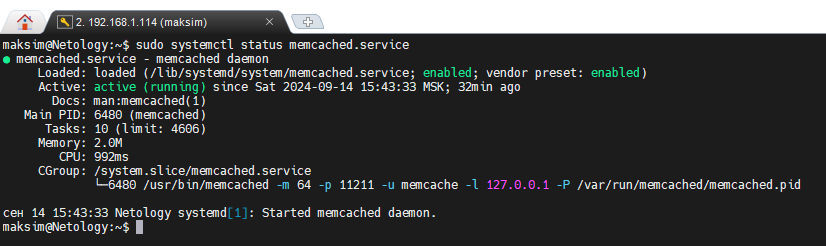
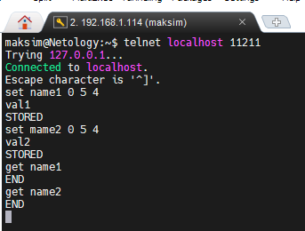
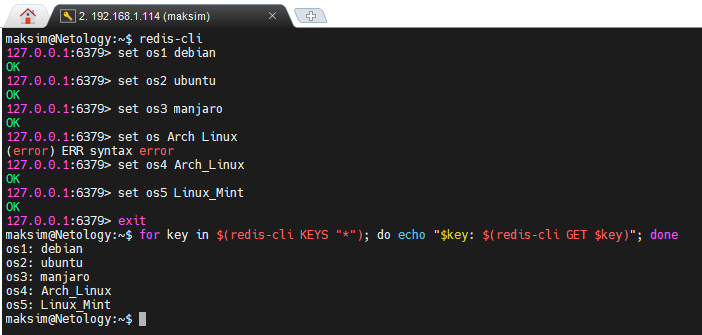
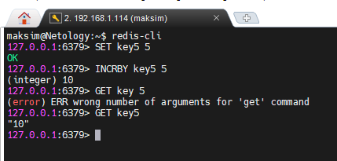

# Домашнее задание к занятию «Кеширование Redis/memcached» — Изотов Максим

### Задание 1. Кеширование 

Приведите примеры проблем, которые может решить кеширование. 

*Приведите ответ в свободной форме.*

#### Ответ 1

* Больша нагрузка на DNS-сервер. Каждый раз, когда кто-то запрашивает один и тот же домен, запрос отправляется на DNS-сервер. Это создаёт излишнюю нагрузку на DNS, особенно если тысячи пользователей запрашивают одно и то же имя, например, домен yandex.ru. Кеширование уменьшает кол-во запросов к DNS, т.к. многие из них обрабатываются локально.

* Экономия ресурсов базы данных, например, применяя 
кэширование тяжелых запросов. Высокое кол-во запросов к базам данных может привести к перегрузке сервера и снижению производительности системы.

* Сглаживание бустов трафика. Например, во время черной 
пятницы онлайн-магазины используют кэш, чтобы переживать 
резкое увеличение трафика. Также, например, на стриминг-сервисе во время выхода новой серии популярного сериала, кеш поможет справиться с нагрузкой, т.к. в кеше память намного быстрее.

* Медленная загрузка веб-страниц из-за постоянных запросов к серверу для получения статического контента. Для ускорения загрузки веб-страниц контент может кешироваться на стороне клиента.

---

### Задание 2. Memcached

Установите и запустите memcached.

*Приведите скриншот systemctl status memcached, где будет видно, что memcached запущен.*

#### Ответ 2

---

### Задание 3. Удаление по TTL в Memcached

Запишите в memcached несколько ключей с любыми именами и значениями, для которых выставлен TTL 5. 

*Приведите скриншот, на котором видно, что спустя 5 секунд ключи удалились из базы.*

#### Ответ 3

---

### Задание 4. Запись данных в Redis

Запишите в Redis несколько ключей с любыми именами и значениями. 

*Через redis-cli достаньте все записанные ключи и значения из базы, приведите скриншот этой операции.*

#### Ответ 4

## Дополнительные задания (со звёздочкой*)
Эти задания дополнительные, то есть не обязательные к выполнению, и никак не повлияют на получение вами зачёта по этому домашнему заданию. Вы можете их выполнить, если хотите глубже разобраться в материале.

### Задание 5*. Работа с числами 

Запишите в Redis ключ key5 со значением типа "int" равным числу 5. Увеличьте его на 5, чтобы в итоге в значении лежало число 10.  

*Приведите скриншот, где будут проделаны все операции и будет видно, что значение key5 стало равно 10.*

#### Ответ 5*

