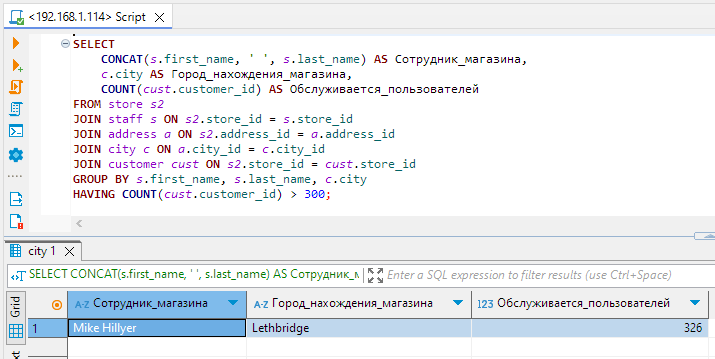
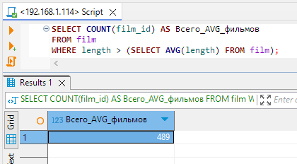
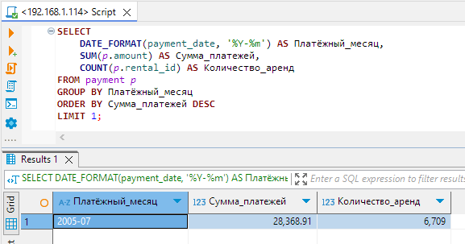

# Домашнее задание к занятию «SQL. Часть 2» — Изотов Максим

Задание можно выполнить как в любом IDE, так и в командной строке.

### Задание 1

Одним запросом получите информацию о магазине, в котором обслуживается более 300 покупателей, и выведите в результат следующую информацию: 
- фамилия и имя сотрудника из этого магазина;
- город нахождения магазина;
- количество пользователей, закреплённых в этом магазине.

#### Ответ 1

```sql
SELECT 
    CONCAT(s.first_name, ' ', s.last_name) AS Сотрудник_магазина,
    c.city AS Город_нахождения_магазина,
    COUNT(cust.customer_id) AS Обслуживается_пользователей
FROM store s2
JOIN staff s ON s2.store_id = s.store_id
JOIN address a ON s2.address_id = a.address_id
JOIN city c ON a.city_id = c.city_id
JOIN customer cust ON s2.store_id = cust.store_id
GROUP BY s.first_name, s.last_name, c.city
HAVING COUNT(cust.customer_id) > 300;
```


### Задание 2

Получите количество фильмов, продолжительность которых больше средней продолжительности всех фильмов.

#### Ответ 2

```sql
SELECT COUNT(film_id) AS Всего_AVG_фильмов
FROM film
WHERE length > (SELECT AVG(length) FROM film);
```


### Задание 3

Получите информацию, за какой месяц была получена наибольшая сумма платежей, и добавьте информацию по количеству аренд за этот месяц.

#### Ответ 3

```sql
SELECT 
    DATE_FORMAT(payment_date, '%Y-%m') AS Платёжный_месяц,
    SUM(p.amount) AS Сумма_платежей,
    COUNT(p.rental_id) AS Количество_аренд
FROM payment p
GROUP BY Платёжный_месяц
ORDER BY Сумма_платежей DESC
LIMIT 1;
```



