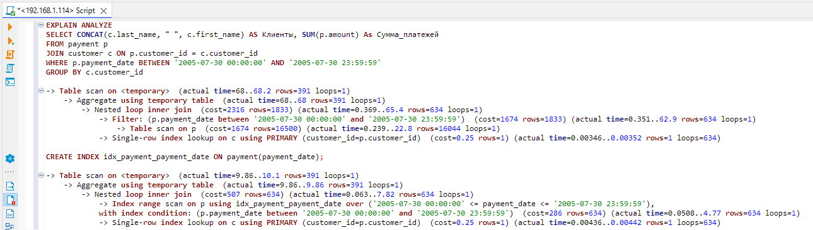

# Домашнее задание к занятию «Индексы» — Изотов Максим

### Задание 1

Напишите запрос к учебной базе данных, который вернёт процентное отношение общего размера всех индексов к общему размеру всех таблиц.

#### Ответ 1

```sql
SELECT
    table_schema as Имя_БД,
    SUM(index_length) / (SUM(data_length) + SUM(index_length)) * 100 As Процент_индексов
FROM INFORMATION_SCHEMA.TABLES
WHERE table_schema = "sakila";
```


### Задание 2

Выполните explain analyze следующего запроса:
```sql
select distinct concat(c.last_name, ' ', c.first_name), sum(p.amount) over (partition by c.customer_id, f.title)
from payment p, rental r, customer c, inventory i, film f
where date(p.payment_date) = '2005-07-30' and p.payment_date = r.rental_date and r.customer_id = c.customer_id and i.inventory_id = r.inventory_id
```
- перечислите узкие места;
- оптимизируйте запрос: внесите корректировки по использованию операторов, при необходимости добавьте индексы.

#### Ответ 2

```sql
EXPLAIN ANALYZE
SELECT DISTINCT CONCAT(c.last_name, ' ', c.first_name), SUM(p.amount) OVER (PARTITION BY c.customer_id, f.title)
FROM payment p, rental r, customer c, inventory i, film f
WHERE DATE(p.payment_date) = '2005-07-30' AND p.payment_date = r.rental_date AND r.customer_id = c.customer_id AND i.inventory_id = r.inventory_id
```
Результат EXPLAIN ANALYZE вернул:


Запрос выполнялся 25.823 секунд.

Узкие места:

* Долго выполняются Temporary table with deduplication и Window aggregate with buffering
* Таблицы inventory и film можно не использовать, т.к. не нужна информация о фильмых, которые могут быть арендованы и не нужна информация о самих фильмах
* Nested loop inner join обрабатывают около 642000 строк
* Поиск по дате приводит к скану таблицы

Действия:

* Не используем таблицы inventory и film.
* Window aggregate with buffering заменим на GROUP BY
* Добавить индекс на дату платежа

Выводим сумму платежей по клиентам, по дате 2005-07-30, при условии что оплата произведена в день аренды:

```sql
EXPLAIN ANALYZE
SELECT CONCAT(c.last_name, " ", c.first_name) AS Клиенты, SUM(p.amount) As Сумма_платежей
FROM payment p 
JOIN customer c ON p.customer_id = c.customer_id
WHERE p.payment_date BETWEEN '2005-07-30 00:00:00' AND '2005-07-30 23:59:59'
GROUP BY c.customer_id
```
Выполнение, без добавления индекса на дату платежа, занимает 68 миллисекунд:

```sql
-> Table scan on <temporary>  (actual time=68..68.2 rows=391 loops=1)
    -> Aggregate using temporary table  (actual time=68..68 rows=391 loops=1)
        -> Nested loop inner join  (cost=2316 rows=1833) (actual time=0.369..65.4 rows=634 loops=1)
            -> Filter: (p.payment_date between '2005-07-30 00:00:00' and '2005-07-30 23:59:59')  (cost=1674 rows=1833) (actual time=0.351..62.9 rows=634 loops=1)
                -> Table scan on p  (cost=1674 rows=16500) (actual time=0.239..22.8 rows=16044 loops=1)
            -> Single-row index lookup on c using PRIMARY (customer_id=p.customer_id)  (cost=0.25 rows=1) (actual time=0.00346..0.00352 rows=1 loops=634)
```
Добавили индекс:
```sql
CREATE INDEX idx_payment_payment_date ON payment (payment_date);
```
Выполнение происходит быстрее - 9.86 миллисекунд:

```sql
-> Table scan on <temporary>  (actual time=9.86..10.1 rows=391 loops=1)
    -> Aggregate using temporary table  (actual time=9.86..9.86 rows=391 loops=1)
        -> Nested loop inner join  (cost=507 rows=634) (actual time=0.063..7.82 rows=634 loops=1)
            -> Index range scan on p using idx_payment_payment_date over ('2005-07-30 00:00:00' <= payment_date <= '2005-07-30 23:59:59'), with index condition: (p.payment_date between '2005-07-30 00:00:00' and '2005-07-30 23:59:59')  (cost=286 rows=634) (actual time=0.0508..4.77 rows=634 loops=1)
            -> Single-row index lookup on c using PRIMARY (customer_id=p.customer_id)  (cost=0.25 rows=1) (actual time=0.00436..0.00442 rows=1 loops=634)
```



#### Ответ 2 (доработка)

В предыдущем ответе указал, что оплата должна происходить в день аренды, а ответ представил без дополнительного "джойна":
```sql
JOIN rental r ON p.payment_date = r.rental_date
```

Выполнение с дополнительным "джойном" немного увеличилось по времени. Перед первым выполнением удалил индекс по дате и далее снова добавил:


## Дополнительные задания (со звёздочкой*)
Эти задания дополнительные, то есть не обязательные к выполнению, и никак не повлияют на получение вами зачёта по этому домашнему заданию. Вы можете их выполнить, если хотите глубже шире разобраться в материале.

### Задание 3*

Самостоятельно изучите, какие типы индексов используются в PostgreSQL. Перечислите те индексы, которые используются в PostgreSQL, а в MySQL — нет.

*Приведите ответ в свободной форме.*

#### Ответ 3*

* Bitmap index
* Partial index
* Function based index
