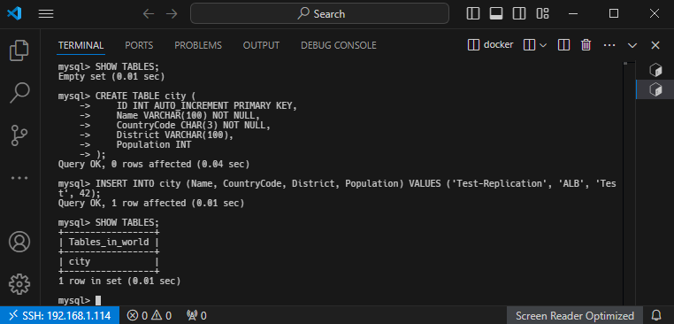

# Домашнее задание к занятию «Репликация и масштабирование. Часть 1» — Изотов Максим

### Задание 1

На лекции рассматривались режимы репликации master-slave, master-master, опишите их различия.

*Ответить в свободной форме.*

#### Ответ 1

* В режиме репликации master-slave master-сервер занимается только записью данных, все изменения данных происходят именно на нём, а считывание данных будет только со slave-сервера. Копии данных slave-сервер получает от master-сервера, репликация происходит в одном направлении: от мастера к слейву.

* В режиме репликации master-master каждый сервер может принимать записи и реплицировать изменения на другой сервер.

---

### Задание 2

Выполните конфигурацию master-slave репликации, примером можно пользоваться из лекции.

*Приложите скриншоты конфигурации, выполнения работы: состояния и режимы работы серверов.*

#### Ответ 2

Конфигурация master:

Конфигурация slave:

Статус Slave:

Описание:

1. Текущее состояние потока (I/O) слейв-сервера ожидает событие от мастера:
    * Slave_IO_State: Waiting for master to send event

2. Слейв функционирует нормально и синхронизирован с мастером, т.к.:

    * Slave_IO_Running: "Yes" - поток I/O работает нормально, или "No", если он остановлен
    * Slave_SQL_Running: "Yes" - поток SQL работает и применяет изменения

3. Last_Errno и Last_Error могут помочь диагностировать проблемы, если репликация остановилась

4. Если Seconds_Behind_Master больше 0, это может указывать на то, что слейв не успевает обрабатывать изменения от мастера и может потребоваться проверка производительности или устранение узких мест в системе.

Далее на master-сервере создаём таблицу city в базе world:

Проверяем на slave-сервере:

Текущий статус Slave после синхронизации с Master:

Последняя позиция прочитанная из журнала мастер ранее равнялась 157, сейчас:

Read_Master_Log_Pos: 1010

---

## Дополнительные задания (со звёздочкой*)
Эти задания дополнительные, то есть не обязательные к выполнению, и никак не повлияют на получение вами зачёта по этому домашнему заданию. Вы можете их выполнить, если хотите глубже шире разобраться в материале.

---

### Задание 3* 

Выполните конфигурацию master-master репликации. Произведите проверку.

*Приложите скриншоты конфигурации, выполнения работы: состояния и режимы работы серверов.*
