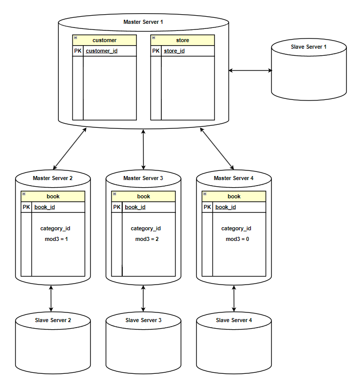

# Домашнее задание к занятию «Репликация и масштабирование. Часть 2» — Изотов Максим

### Задание 1

Опишите основные преимущества использования масштабирования методами:

- активный master-сервер и пассивный репликационный slave-сервер; 
- master-сервер и несколько slave-серверов;

*Дайте ответ в свободной форме.*

#### Ответ 1

Активный master-сервер и пассивный репликационный slave-сервер:

* **Резервное копирование**

    Репликации данных на слейв обеспечивает защищенное хранение данных. В случае повреждения данных на мастере можно восстановить данные из резервной копии.

* **Отказоустойчивость**

    Если мастер выходит из строя, слейв может быть быстро переведен в статус мастер и обеспечить высокую надежность и минимум времени простоя.

* **Снижение нагрузки на мастер**
    
    Слейв может брать на себя некоторые задачи анализа, также разделение функционала: запись, чтение

Master-сервер и несколько slave-серверов:

Помимо того что было перечислено выше, также:

* **Региональная доступность**

    Несколько слейвов могут быть развернуты географически в разных регионах, что увеличивает отказоустойчивость, снижает задержки доступа для пользователей.

* **Аналитические задачи**

    Любые тяжелые на вычисления аналитические задачи могут выполняться на отдельных слейвах без влияния на производительность основной системы.

---

### Задание 2

Разработайте план для выполнения горизонтального и вертикального шаринга базы данных. База данных состоит из трёх таблиц: 

- пользователи, 
- книги, 
- магазины (столбцы произвольно). 

Опишите принципы построения системы и их разграничение или разбивку между базами данных.

*Пришлите блоксхему, где и что будет располагаться. Опишите, в каких режимах будут работать сервера.* 

#### Ответ 2

**Горизонтальный шардинг**

Master Server 1 будет хранить данные о клиентах и магазинах. Данный сервер будет центральным узлом, который будет взаимодействовать с другими мастер-серверами, ответственными за шардированные данные.

Данные по категориям книг разобьём на три шарда. Разобьём с использованием вычетов по модулю равному 3. Например, Master Server 2 будет хранить категории книг с ID 2, 5, 8.

Каждый мастер-сервер будет иметь один подчинённый слейв-сервер:

**Вертикальный шардинг**

Каждая таблица находится на отдельном мастер-сервере, у каждого мастера свой слейв:

## Дополнительные задания (со звёздочкой*)
Эти задания дополнительные, то есть не обязательные к выполнению, и никак не повлияют на получение вами зачёта по этому домашнему заданию. Вы можете их выполнить, если хотите глубже шире разобраться в материале.

---
### Задание 3*

Выполните настройку выбранных методов шардинга из задания 2.

*Пришлите конфиг Docker и SQL скрипт с командами для базы данных*.
