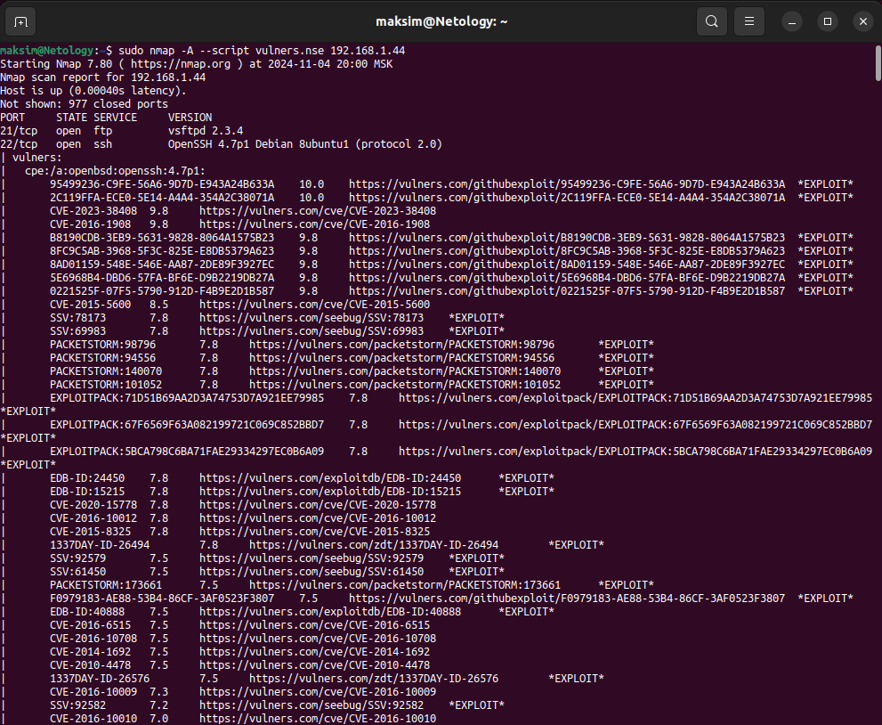

# Домашнее задание к занятию «Уязвимости и атаки на информационные системы» — Изотов Максим

### Задание 1

Скачайте и установите виртуальную машину Metasploitable: https://sourceforge.net/projects/metasploitable/.

Это типовая ОС для экспериментов в области информационной безопасности, с которой следует начать при анализе уязвимостей.

Просканируйте эту виртуальную машину, используя **nmap**.

Попробуйте найти уязвимости, которым подвержена эта виртуальная машина.

Сами уязвимости можно поискать на сайте https://www.exploit-db.com/.

Для этого нужно в поиске ввести название сетевой службы, обнаруженной на атакуемой машине, и выбрать подходящие по версии уязвимости.

Ответьте на следующие вопросы:

- Какие сетевые службы в ней разрешены?
- Какие уязвимости были вами обнаружены? (список со ссылками: достаточно трёх уязвимостей)
  
*Приведите ответ в свободной форме.* 

#### Ответ 1

Сприсок разрешенных сетевых служб:

Спилок уязвимостей:

1. [Apache 2.4.x - Buffer Overflow (CVE-2021-44790)](https://www.exploit-db.com/exploits/51193)
2. [FreeBSD 9.1 - 'ftpd' Remote Denial of Service (CVE-2011-0418)](https://www.exploit-db.com/exploits/24450)
3. [Vulnerability in core server (CVE-2021-32029)](https://vulners.com/cve/CVE-2021-32029)

Команда `sudo nmap -A --script vulners.nse 192.168.1.44` выполняет сканирование на уязвимости с использованием скрипта `vulners.nse`:

### Задание 2

Проведите сканирование Metasploitable в режимах SYN, FIN, Xmas, UDP.

Запишите сеансы сканирования в Wireshark.

Ответьте на следующие вопросы:

- Чем отличаются эти режимы сканирования с точки зрения сетевого трафика?
- Как отвечает сервер?

*Приведите ответ в свободной форме.*

#### Ответ 2

Записи сеансов сканирования в Wireshark:

1. [TCP SYN.pcapng](file/1/TCP%20SYN.pcapng)
2. [TCP FIN.pcapng](file/1/TCP%20FIN.pcapng)
3. [Xmas.pcapng](file/1/Xmas.pcapng)
4. [UDP.pcapng](file/1/UDP.pcapng)

Отличия режимов сканирования и ответы сервера:

SYN, FIN, и Xmas-сканирования используют разные комбинации TCP-флагов для определения состояния порта, тогда как UDP-сканирование работает с бесфлаговыми UDP-пакетами и полагается на ICMP-ответы для определения закрытых портов.

Команда `sudo nmap -sS 192.168.1.44` отправляет SYN-пакет на порт. Сервер отвечает SYN-ACK если порт открыт, если закрыт - RST-ACK.

`sudo nmap -sA 192.168.1.44` отправляет на порт FIN-пакет. Сервер отвечает RST если порт закрыт, если порт открыт - не отвечает.

`sudo nmap -sX 192.168.1.44` отправляет три TCP-флага [FIN, PSH, URG]. Сервер отвечает RST-ACK если порт закрыт, если порт открыт - не отвечает.

`sudo nmap -sU 192.168.1.44` на порт отправляет UDP-пакет. Сервер отвечает ICMP-пакетом "Destination Unreachable" (порт недоступен), если порт открыт - не отвечает.